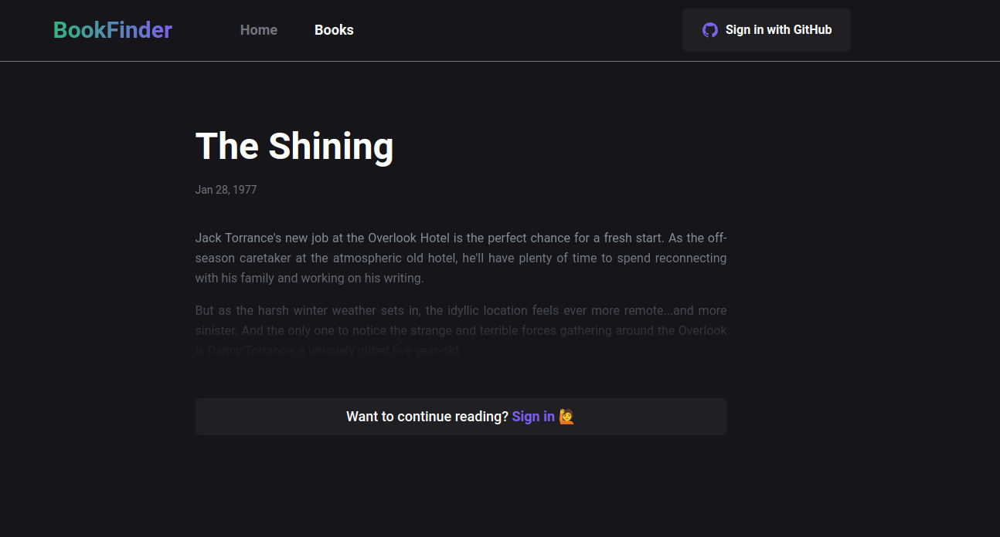

<h1 align="center"> BookFinder </h1>

Deciding what to read next?
We’ll give you surprisingly insightful recommendations

  

  <a href="#-technologies">Technologies</a>&nbsp;&nbsp;&nbsp;|&nbsp;&nbsp;&nbsp;
  <a href="#-project">Project</a>&nbsp;&nbsp;&nbsp;|&nbsp;&nbsp;&nbsp;
  <a href="#-layout">Layout</a>&nbsp;&nbsp;&nbsp;|&nbsp;&nbsp;&nbsp;
  <a href="#-license">License</a>

  

 

  

## 🚀 Technologies

This project was developed with the following technologies:

- Tailwind CSS
- Next.Js
- GraphQL
- Cookies
- NextAuth
- Apollo

## 💻 Project

BookFinder is a blog that recommends books according to the genre you prefer

- [Final project](https://bookfinder-nu.vercel.app/)

## 🔖 Layout

You can view the layout through this [LINK](https://www.figma.com/file/Y4lxlNujNoMVPfcmngBG4c/BookFinder?node-id=0%3A1&t=UuivCF4hlRqik53p-1).

## :memo: License

This project is licensed under the MIT license.

---

Made by ♥ gustavosalviato :wave: [contact](https://www.linkedin.com/in/gustavo-salviato-910048212/)